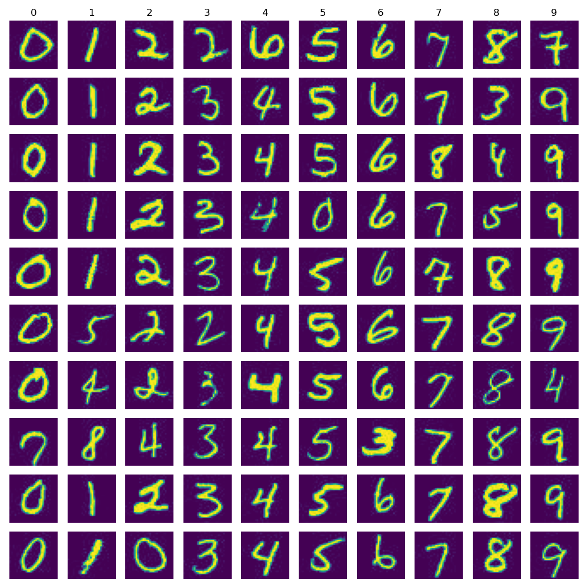
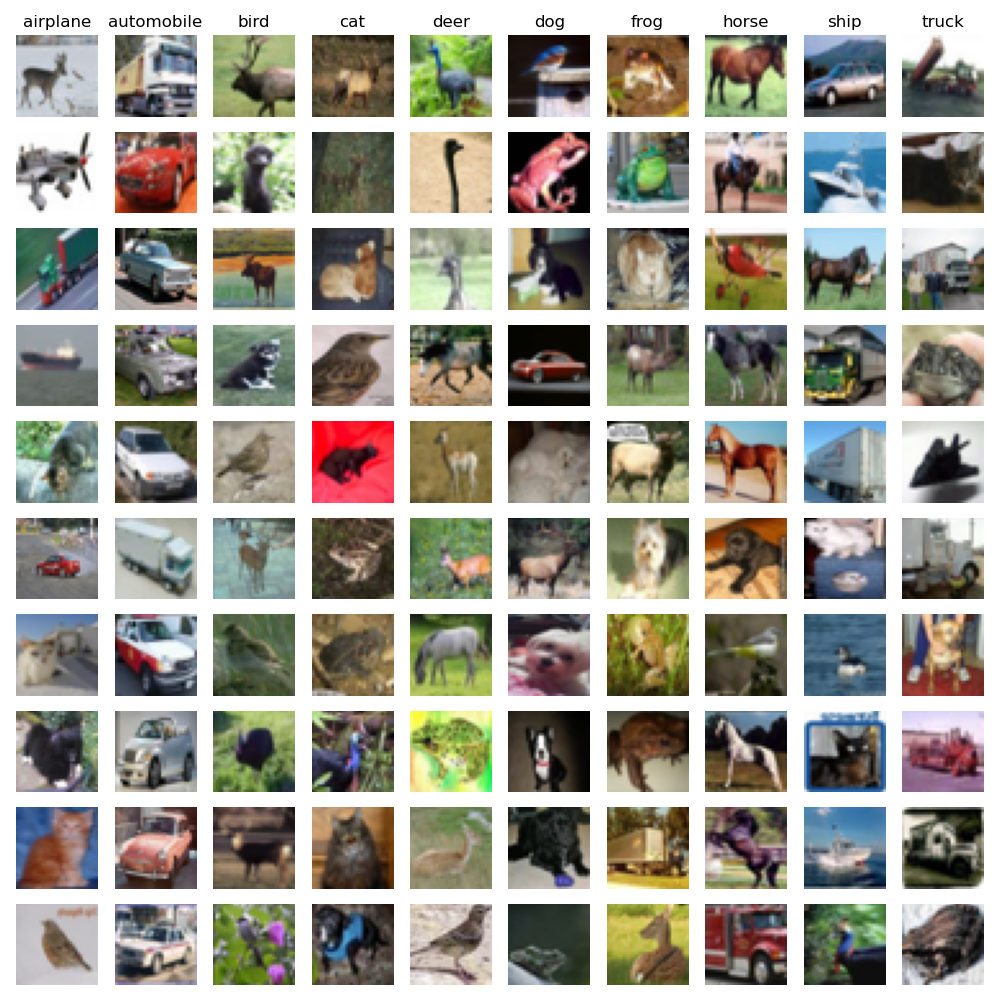

### Example 

`python3 example.py MNIST`

with network 
```angular2html
net = Network(
    Layer(128, 'relu'),
    Layer(n_classes, 'softmax')
)
```
```
epoch:0 loss: 483.7010	diff: nan
epoch:1 loss: 474.1666	diff: -9.5343904481774188753
epoch:2 loss: 481.6295	diff: 7.4629149634126861201
epoch:3 loss: 452.1254	diff: -29.5040943174705034835
epoch:4 loss: 455.5423	diff: 3.4169430448723687732
epoch:5 loss: 438.7210	diff: -16.8213207526469545883
epoch:6 loss: 448.6551	diff: 9.9341010839281693734
...
epoch:97 loss: 217.9652	diff: -7.0904335448849735712
epoch:98 loss: 222.3247	diff: 4.3595000844830167352
epoch:99 loss: 211.4921	diff: -10.8326698184510803458
78.55% correct prediction```
```



`python3 example.py CFAR`

```
epoch:0 loss: 463.7164	diff: nan
epoch:1 loss: 459.6983	diff: -4.0180578213115722974
epoch:2 loss: 455.3646	diff: -4.3337484857182175801
epoch:3 loss: 459.1686	diff: 3.8040054887398468964
epoch:4 loss: 450.2621	diff: -8.9065157145545299500
epoch:5 loss: 443.1323	diff: -7.1297374199405112449
...
epoch:97 loss: 349.3897	diff: 12.4626050493847060352
epoch:98 loss: 331.9752	diff: -17.4144921290412639792
epoch:99 loss: 366.2732	diff: 34.2980079288215051747
38.9% correct prediction```
```



